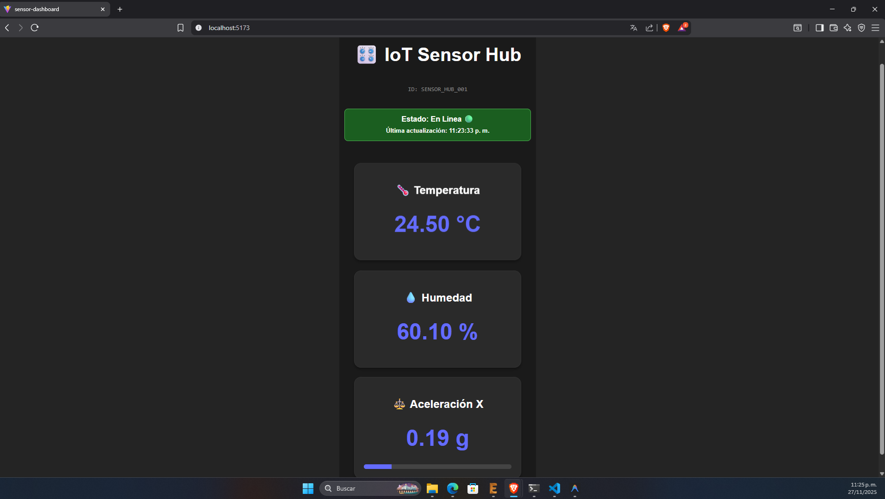
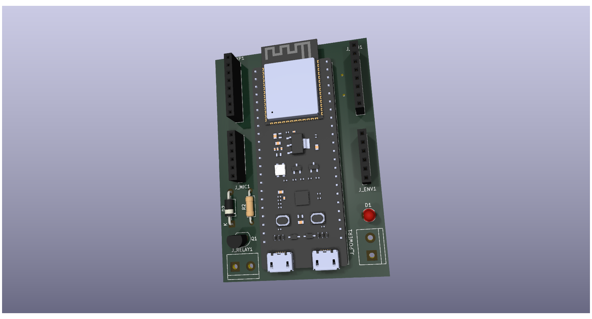
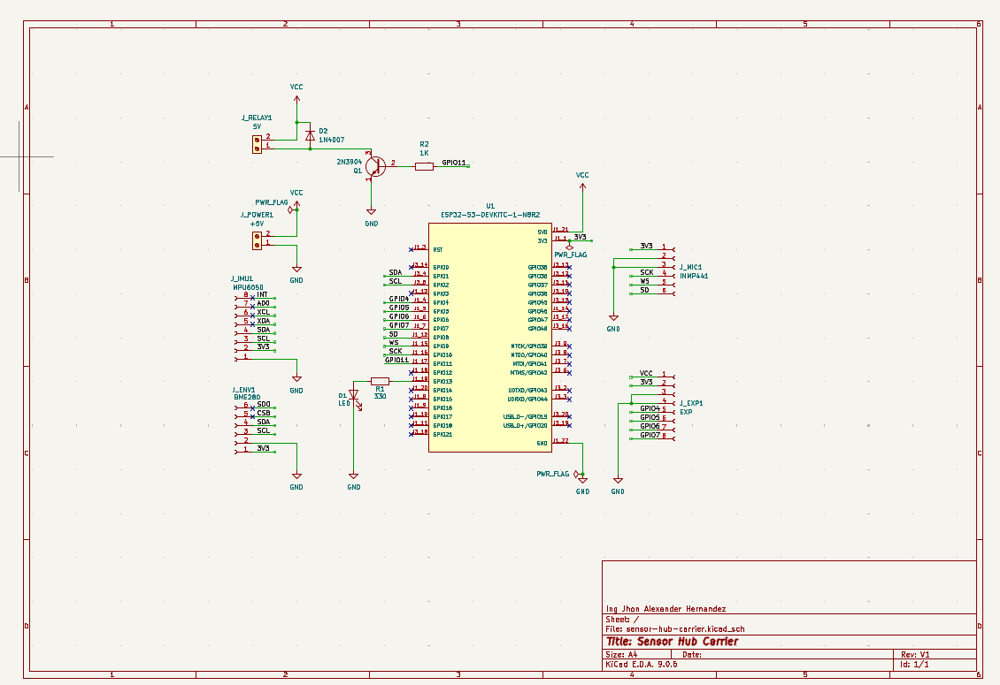

# 🏭 **Industrial IoT Sensor Hub (v1.1)**

### **High-Performance Data Acquisition System with ESP32-S3 & FreeRTOS**

Este proyecto demuestra una solución IoT **End-to-End**, conectando
hardware embebido (C++) con visualización web moderna (React).

------------------------------------------------------------------------

## 🖥️ **Real-Time Dashboard Interface**



-   **Communication:** Conexión directa a HiveMQ Cloud vía **Secure
    WebSockets (WSS)**\
-   **Latency:** Actualizaciones en tiempo real (\<100ms) desde el
    ESP32-S3\
-   **Data Visualization:** Lectura sincronizada de sensores ambientales
    (BME280) e inerciales (MPU6050)\
-   **Protocol:** Decodificación de JSON directamente en navegador

------------------------------------------------------------------------

## 📦 **Hardware Revision v1.1 --- Carrier Board**

La placa contiene un diseño modular que integra ESP32-S3, sensores,
etapa de potencia y puertos de expansión.

### ⚡ Schematic & PCB Layout

<table>
  <tr>
    <td align="center"><strong>3D Render (Physical)</strong></td>
    <td align="center"><strong>Schematic (Logical)</strong></td>
  </tr>
  <tr>
    <td align="center">
      
    </td>
    <td align="center">
      
    </td>
  </tr>
  <tr>
    <td align="center"><em>Designed in KiCad 9 — Raytracing Render</em></td>
    <td align="center"><em>Low-Side Switch & I²C Bus Topology</em></td>
  </tr>
</table>

### 🔩 **Technical Specs**

  -----------------------------------------------------------------------
  Subsystem             Components              Description
  --------------------- ----------------------- -------------------------
  **MCU Core**          ESP32-S3-DevKitC-1      Dual-core Xtensa LX7 @
                                                240MHz, WiFi + BLE 5.0

  **Inertial**          MPU6050                 6-Axis Accelerometer &
                                                Gyroscope (I2C: 0x68)

  **Environmental**     BME280                  Temp, Humidity, Pressure
                                                (I2C: 0x77)

  **Actuator Control**  2N2222 + Flyback Diode  Low-Side Switch para
                                                relés/motores (GPIO 11)

  **Audio Input**       Header for INMP441      Puerto I2S para micrófono
                                                MEMS

  **Expansion**         8-Pin Header            GPIOs adicionales +
                                                rieles 5V/3.3V
  -----------------------------------------------------------------------

### 📂 **Manufacturing Files**

Archivos Gerber listos para producción:

➡️ **[Download Gerbers v1.1
(ZIP)](\hardware\sensor-hub-carrier\Gerbers\Gerbers_SensorHub_v1.1.zip)**

------------------------------------------------------------------------

## 📂 **Project Structure (ESP-IDF Standard)**

``` text
01-sensor-hub/
├── components/        # Modular Drivers (C++ Classes)
│   ├── bme280/        # I2C Driver for Environmental Sensor
│   ├── mpu6050/       # I2C Driver for IMU
│   └── wifi_connect/  # WiFi Station Manager
├── main/              # Application Entry Point (FreeRTOS Tasks)
├── sensor-dashboard/  # React Frontend (Vite + MQTT.js)
├── hardware/          # KiCad 9 Design Files (Schematic, PCB, Gerbers)
├── tools/             # Python Scripts for data ingestion testing
└── docs/              # Documentation & assets
```

------------------------------------------------------------------------

# 🔧 **Setup Instructions**

------------------------------------------------------------------------

## 1️⃣ **Firmware Deployment (ESP32-S3)**

**Prerequisite:** VS Code + Espressif IDF Extension (v5.x)

1.  Abre el proyecto en VS Code\
2.  Configura WiFi en:\
    `components/wifi_connect/include/wifi_connect.h`\
3.  Configura credenciales MQTT en:\
    `main/main.cpp`\
4.  Compila usando el icono **Build (Cylinder)**\
5.  Flashea el firmware con **Flash (Lightning)**

------------------------------------------------------------------------

## 2️⃣ **Dashboard Setup (React)**

1.  Entra al directorio:

    ``` bash
    cd sensor-dashboard
    ```

2.  Instala dependencias:

    ``` bash
    npm install
    ```

3.  Ejecuta el servidor de desarrollo:

    ``` bash
    npm run dev
    ```

4.  Abre en el navegador:\
    **http://localhost:5173**

------------------------------------------------------------------------

## 3️⃣ **HiveMQ Cloud Configuration**

1.  Crea un cluster gratuito en HiveMQ Cloud\
2.  Genera credenciales (User/Password)\
3.  Actualiza los archivos:
    -   Frontend: `App.jsx`\
    -   Firmware: `main.cpp`

------------------------------------------------------------------------

# 📊 **Data Flow Architecture**

1.  **Sensor Acquisition:** BME280 & MPU6050 → Bus I²C\
2.  **Edge Processing:** ESP32-S3 serializa lecturas en JSON (cJSON)\
3.  **Cloud Routing:** Publicación segura vía MQTT (TLS 1.2) a HiveMQ
    Cloud\
4.  **Real-Time Display:** React + MQTT.js → WebSockets (WSS)

------------------------------------------------------------------------

# 📜 **License**

**MIT License --- Open Source**
